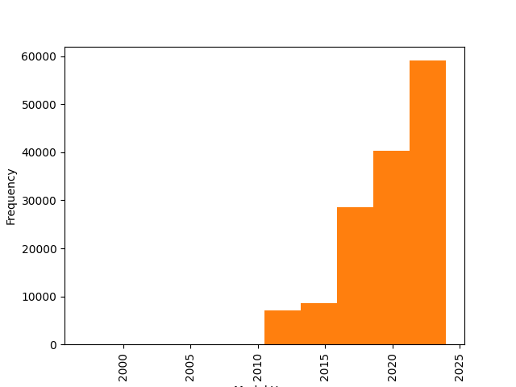

Describe:
|       |   Postal Code |   Model Year |   Electric Range |   Base MSRP |   Legislative District |   DOL Vehicle ID |   2020 Census Tract |
|:------|--------------:|-------------:|-----------------:|------------:|-----------------------:|-----------------:|--------------------:|
| count |     143574    |   143596     |      143596      |   143596    |            143269      | 143596           |    143574           |
| mean  |      98175.2  |     2019.87  |          70.4957 |     1373.39 |                29.3717 |      2.09202e+08 |         5.29759e+10 |
| std   |       2383.17 |        3.016 |          97.1287 |     9450.07 |                14.8239 |      8.3537e+07  |         1.59404e+09 |
| min   |       1730    |     1997     |           0      |        0    |                 1      |   4385           |         1.08104e+09 |
| 25%   |      98052    |     2018     |           0      |        0    |                18      |      1.66834e+08 |         5.3033e+10  |
| 50%   |      98122    |     2021     |          19      |        0    |                33      |      2.11104e+08 |         5.3033e+10  |
| 75%   |      98370    |     2022     |         111      |        0    |                43      |      2.36452e+08 |         5.30531e+10 |
| max   |      99403    |     2024     |         337      |   845000    |                49      |      4.79255e+08 |         5.6033e+10  |

